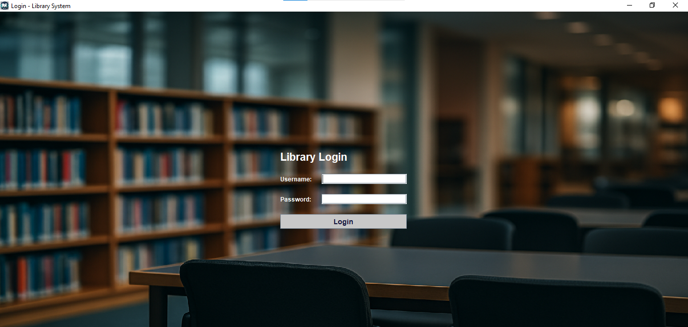
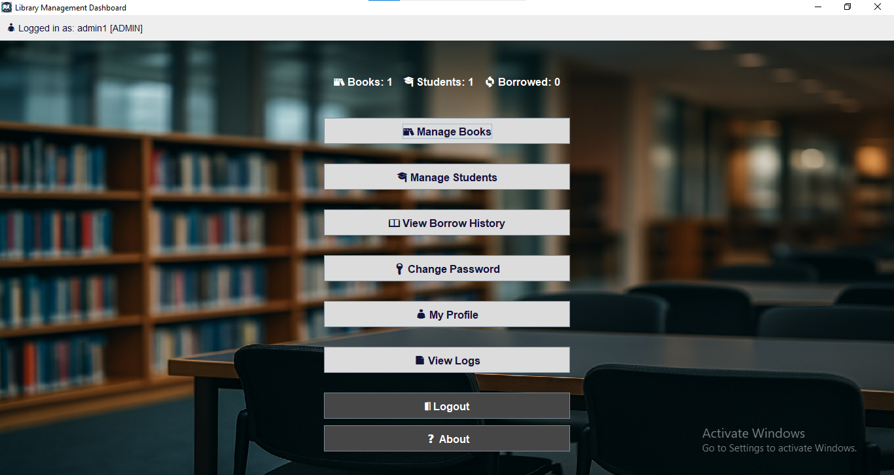

# **📚 Library Management System**

A desktop-based Library Management System built with **Java Swing and SQLite**. 
It allows users to manage books, students, and borrowing records with a secure login system.

## ✨ Features

- Secure login with failed attempt tracking.
- Add / Edit / Delete books and students.
- Manage student records.
- Borrow and return books with due date tracking.
- User profile page with session details.
- User authentication with roles (admin/user).
- Logs saved to `logs/operations.log` .
- Export borrow history to CSV and PDF.
- UI built with Java Swing and JCalendar for date picking.
- Modern UI with icons and backgrounds.
- Embedded SQLite database (no external server required).

- ## 🛠 Technologies

- Java (JDK 17/21)
- Java Swing
- SQLite
- NetBeans IDE
- JCalendar, iText

- ## 🚀 Installation

1. Clone the repository to your local machine.
2. Open the project in NetBeans or your preferred IDE.
3. Make sure the SQLite database file is placed in the root folder.
4. Run the `MainApp` class to start the application.

5. ## 📌 Usage

Default login credentials:
- **Username:** admin1
- **Password:** admin123

## 📷 Screenshots

### Login Screen

### Dashboard

## 📜 License

This project is licensed under the MIT License - see the LICENSE file for details.

## 📬 Contact

**Engy Mohamed Ali Hanafy**  

📧 **Email**: eng.engymohamed33@gmail.com

🔗 **GitHub**: https://github.com/Engy-Mohamed-Ali

🔗 **LinkedIn**: www.linkedin.com/in/engy-hanafy33
